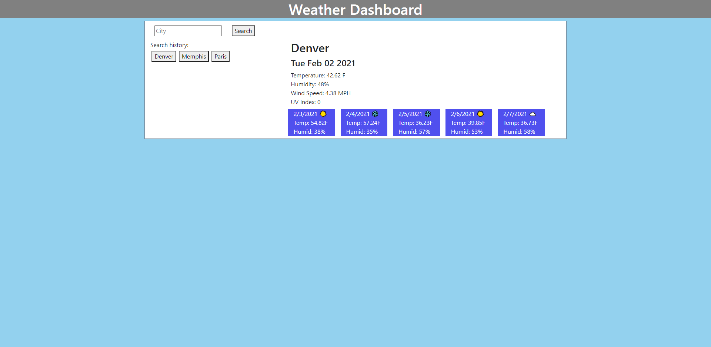

Deployed at: https://gsonnier333.github.io/weather-dashboard/

Example of site being used:

For this assignment, I created a page that allows the user to search for cities by name and get a weather forecast for any city they want that includes the current day as well as the next five. After a user searches for a city, that city can be instantly searched for again by clicking the dynamically created button on the left side of the screen with the city's name on it. As the user searches for more cities, more buttons will appear on the side of the screen, one for each city. This search history is stored in local storage, so the list of previously searched cities persists even after the tab is refreshed.

In building this site, I learned about Date objects in vanilla JavaScript, as well as how to parse unix formatted time into a readable date. I also got more practice using third-party APIs and ajax calls. I learned more about arrays in JavaScript by having to manipulate the search history array in more unique ways than just adding or changing elements.
